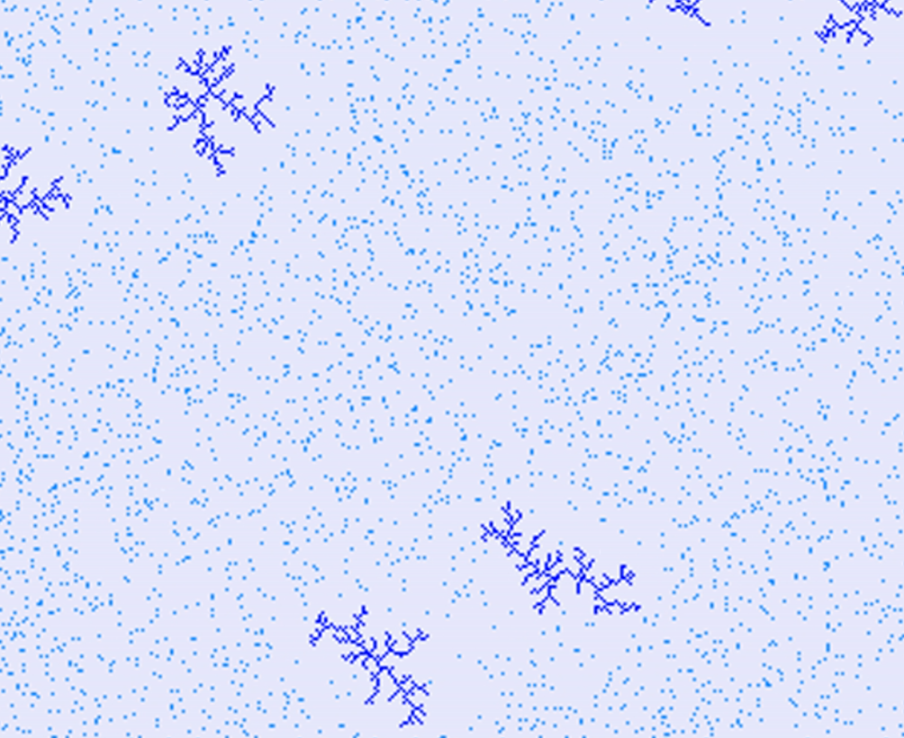

# Cristal growth Simulation

Simulating crystals provides profound insights into the world of materials. It allows us to understand the structure, properties, and behavior of materials, forming the foundation for discoveries in fields like materials science, chemistry, and physics. These simulations not only aid in discovering new materials but also in enhancing the performance and applicability of existing ones.

In the industrial sector, crystal simulations are invaluable for optimizing manufacturing processes, particularly in the semiconductor industry, leading to improved product quality and performance. Moreover, crystal simulations play a pivotal role in unraveling physical and chemical phenomena, from atomic and molecular interactions within crystal lattices to phenomena like phase transitions, magnetism, and electrical conductivity. They empower scientists and engineers to predict and control material properties, a vital component for progress and innovation in various industries, including semiconductor manufacturing, metallurgy, and polymer development.

## Ideas:

1. Diffusion-Limited Aggregation (DLA):
    - Particles are introduced randomly and move until they stick to the existing structure.
    - They move in a random walk pattern and aggregate around the existing crystals.

2. Cellular Automaton:

    - Use a grid where each cell can be in a few states (e.g., on or off).
    - Apply rules that determine the state of each cell based on its neighbors.
    - Create complex patterns by iterating through generations.

3. Reaction-Diffusion:

    - Simulate the interactions of two or more chemicals that diffuse and react with each other.
    - Turing patterns can emerge, leading to spatially varying structures.

4. Voronoi Diagrams:

    - Place seeds randomly on the plane.
    - Assign each point in the plane to the nearest seed, creating Voronoi cells.
    - Crystals grow within these cells.

5. Snowflake Growth:

    - Use a simple algorithm to generate the fractal growth of a snowflake.
    - Typically, it involves adding smaller branches to the sides of existing branches.

6. Dendritic Growth:

    - Simulate the growth of crystals with dendritic or tree-like structures.
    - Crystals grow preferentially along the direction of a temperature gradient or in areas with higher concentration of a growth-promoting substance.

7. Boundary-Limited Growth:

    - Crystals grow within defined boundaries, creating intricate edge patterns.
    - This can mimic real-world scenarios where crystals grow within a confined space.

8. Electrodeposition:

    - Simulate the growth of crystals on an electrode surface.
    - Crystals grow when ions are deposited onto the electrode under the influence of an electric field.

9. Biological Growth Simulation:

    - Simulate the growth of structures based on biological models.
    - For example, model the branching of trees or the formation of coral reefs.

## Results:

1. Diffusion-Limited Aggregation (DLA):

    

