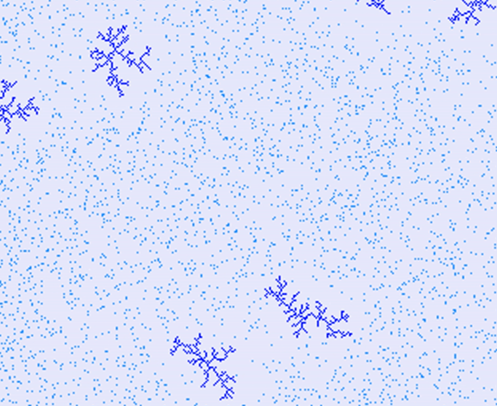

# Cristal growth Simulation

Die Simulation von Kristallen bietet einen tiefen Einblick in die Welt der Materialien. Sie ermöglicht uns, die Struktur, Eigenschaften und Verhalten von Materialien zu verstehen, was grundlegend für Entdeckungen in Bereichen wie Materialwissenschaft, Chemie und Physik ist. Diese Simulationen tragen nicht nur zur Entdeckung neuer Materialien bei, sondern ermöglichen auch die Verbesserung bestehender, was die Leistung und Anwendbarkeit dieser Materialien steigert.

In der Industrie sind Kristallsimulationen von unschätzbarem Wert, um Herstellungsprozesse zu optimieren, insbesondere in der Halbleiterindustrie. Sie helfen, die komplexen Vorgänge des Kristallwachstums zu erforschen und tragen dazu bei, die Qualität und Leistung von Produkten zu steigern.

Kristallsimulationen spielen auch eine Schlüsselrolle bei der Untersuchung von physikalischen und chemischen Phänomenen, von Atom- und Molekülinteraktionen in Kristallgittern bis zu Phasenübergängen, Magnetismus und elektrischer Leitfähigkeit. Sie ermöglichen die Vorhersage und gezielte Steuerung von Materialeigenschaften, was in verschiedenen Branchen wie der Halbleiterherstellung, Metallurgie und Polymerentwicklung von großer Bedeutung ist.

## Ideen:
1. Diffusion-Limited Aggregation (DLA):

    - Teilchen werden zufällig eingeführt und bewegen sich, bis sie an der bestehenden Struktur haften.
    - Sie bewegen sich in einem zufälligen Muster und aggregieren sich um die bestehenden Kristalle.

2. Cellular Automaton:

    - Verwenden Sie ein Raster, in dem jede Zelle in einigen Zuständen sein kann (z. B. an oder aus).
    - Wenden Sie Regeln an, die den Zustand jeder Zelle basierend auf ihren Nachbarn bestimmen.
    - Erzeugen Sie komplexe Muster, indem Sie Generationen durchlaufen.

3. Reaction-Diffusion:

    - Simulieren Sie die Wechselwirkungen von zwei oder mehr Chemikalien, die miteinander diffundieren und reagieren.
    - Turing-Muster können auftreten und räumlich unterschiedliche Strukturen erzeugen.

4. Voronoi Diagrams:

    - Platzieren Sie Samen zufällig auf der Ebene.
    - Ordnen Sie jeden Punkt in der Ebene dem nächsten Samen zu und erstellen Sie Voronoi-Zellen.
    - Kristalle wachsen innerhalb dieser Zellen.

5. Snowflake Growth:

    - Verwenden Sie einen einfachen Algorithmus, um das fraktale Wachstum eines Schneekristalls zu generieren.
    - Normalerweise beinhaltet dies das Hinzufügen kleinerer Zweige zu den Seiten bereits vorhandener Zweige.

6. Dendritic Growth:

    - Simulieren Sie das Wachstum von Kristallen mit dendritischen oder baumartigen Strukturen.
    - Kristalle wachsen bevorzugt in Richtung eines Temperaturgradienten oder in Bereichen mit höherer Konzentration einer wachstumsfördernden Substanz.

7. Boundary-Limited Growth:

    - Kristalle wachsen innerhalb definierter Grenzen und erzeugen komplexe Randmuster.
    - Dies kann reale Szenarien nachahmen, in denen Kristalle in einem begrenzten Raum wachsen.

8. Electrodeposition:

    - Simulieren Sie das Wachstum von Kristallen auf einer Elektrodenoberfläche.
    - Kristalle wachsen, wenn Ionen unter dem Einfluss eines elektrischen Feldes auf die Elektrode abgelagert werden.

9. Biological Growth Simulation:

    - Simulieren Sie das Wachstum von Strukturen auf der Grundlage biologischer Modelle.
    - Zum Beispiel die Verzweigung von Bäumen oder die Bildung von Korallenriffen modellieren.

## Results:

1. Diffusion-Limited Aggregation (DLA):

    

2. Cellular Automaton:
